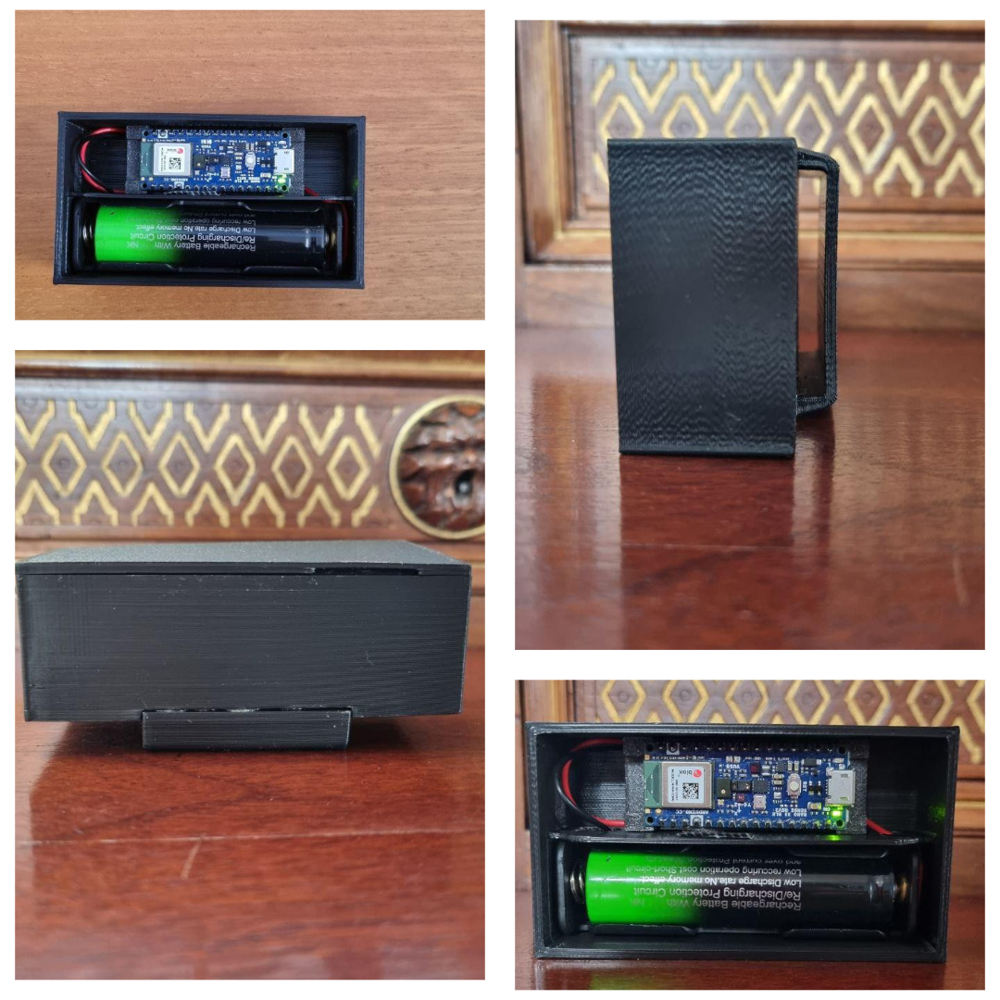

# Sistema di Rilevamento Cadute con Arduino Nano 33 BLE e App Flutter

## Anteprima del Dispositivo
Ecco il prototipo del dispositivo di rilevamento cadute in azione:

  

<em>
Il dispositivo assemblato: Arduino Nano 33 BLE Sense Rev2 alimentato da batteria LiPo.
</em>

## Table of Contents
* [Descrizione progetto](#descrizione)
* [Tecnologie](#tecnologie)
* [Componenti hardware](#hardware)
## Descrizione progetto
Questo progetto implementa un sistema wearable per il rilevamento di cadute, pensato principalmente per persone anziane sopra i 65 anni. Il sistema sfrutta:

- Arduino Nano 33 BLE con sensori integrati di accelerometro e giroscopio per rilevare i movimenti del corpo.

- App Android sviluppata con Flutter, che utilizza Bluetooth Low Energy (BLE) per comunicare con Arduino.

- Bot Telegram per notificare un contatto di fiducia in caso di caduta.

Il sistema rileva una possibile caduta analizzando i dati del sensore e confrontandoli con soglie predefinite. In caso di caduta, l'app invia una notifica al bot Telegram, che a sua volta informa un contatto fidato, permettendo un intervento tempestivo.
## Tecnologie
- C/C++
- Flutter
- Python
## Componenti hardware
- Arduino nano 33 BLE sese rev 2
- LiPo battery 3.7v
## Riferimenti
- Wang FT, Chan HL, Hsu MH, Lin CK, Chao PK, Chang YJ. Threshold-based fall detection using a hybrid of tri-axial accelerometer and gyroscope. Physiol Meas. 2018 Oct 11;39(10):105002. doi: 10.1088/1361-6579/aae0eb. PMID: 30207983. (https://pubmed.ncbi.nlm.nih.gov/30207983/)

## Screenshots app

## Video

[Watch the video](https://www.youtube.com/shorts/cjsNU6j6KOw)

